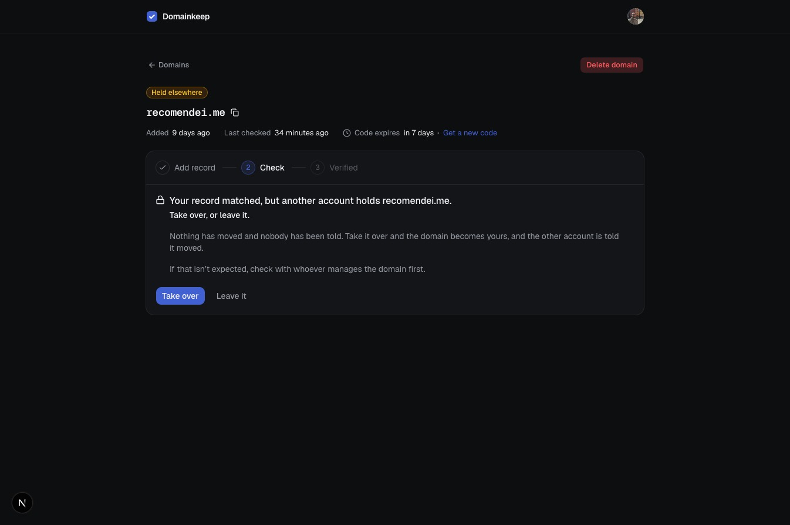
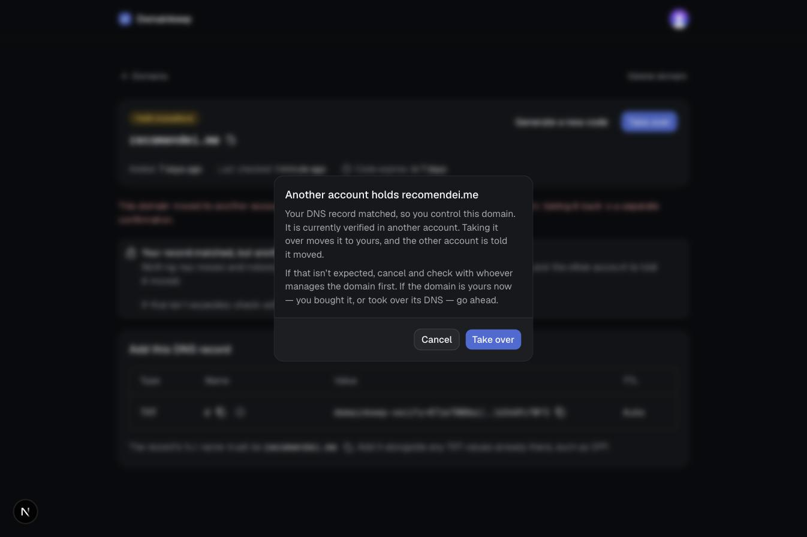
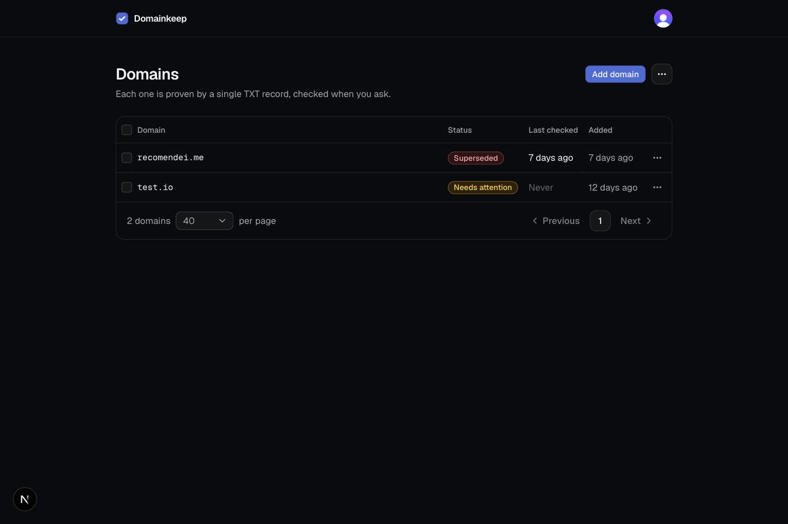
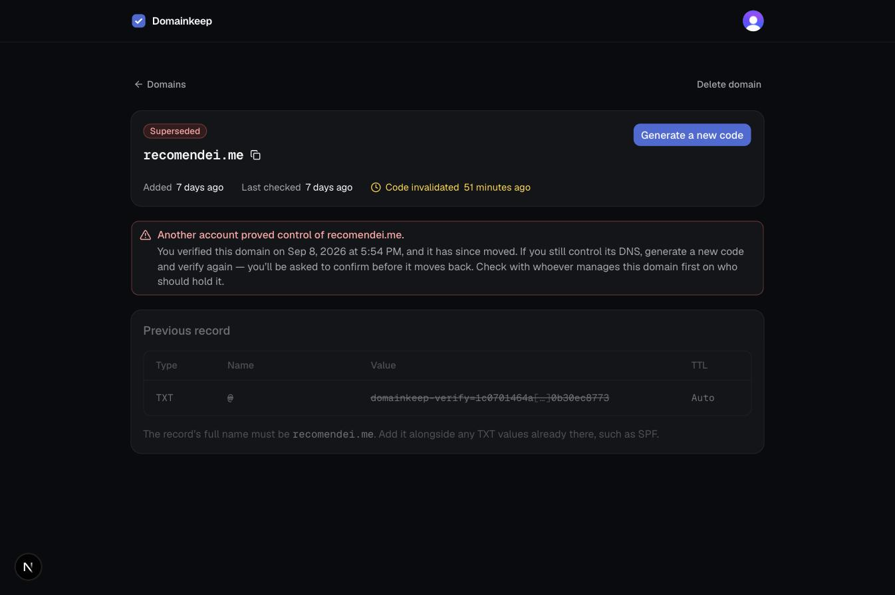

# Screenshots

Every screen a user can reach, for anyone who would rather look than sign up. Captured from a local build on 2026-09-15.

## The domains list

Every state names itself, and the next step sits beside it, so the list reads as a to-do list: the domains that still need something sort above the verified ones. The name opens the domain; one menu per row holds Manage and Delete, and the rows another lookup could still change add a Check to the menu and show one under the pointer. Rows can be selected and deleted together; the page size and page number live in the URL.

## Adding a domain

Validation runs the same normalization the server uses, so the feedback is instant and specific. Adding never runs a DNS lookup.

## The record and its check

A domain that has never been checked. The domain is the page title, the line under it says which of add record, check and verified the domain is at, and the code's expiry is the one timestamp that can turn amber. The record and the button that checks it share one card, so reading the page top to bottom ends at the action. Type, Name, Value, and TTL are laid out the way a DNS provider asks for them: Name is the provider-style label, the full hostname is spelled out underneath, and every value is copyable.

## Record not found

The first miss is usually propagation, so the copy says "yet", the code stays valid, and the checklist stays folded until opened. It stays open across a re-check.

## Value mismatch

The record exists but no value matches. The panel opens with the fix, and the expected value sits beside what DNS actually returned, so correcting it is a comparison rather than a guess.

## DNS did not respond

A lookup that timed out or was refused. Nothing needs changing; the user retries.

## Expired

A code past its seven days. The previous record is shown struck through for reference, and the only way forward is a new code.

## Held elsewhere

The record matched, but another account holds the domain. Nothing has moved and nobody has been told; the transfer runs only on an explicit Take over. This one is the previous holder taking their domain back after being superseded, so the note above the alert names when it moved.

The confirmation that follows. Cancelling sends nothing; the other account learns of the transfer only if the user goes ahead.

## Verified

Verification is point in time. The record card is gone and the user is told the TXT value can be removed.

## Moved away

The previous holder's view after another account proved control: the row in their list, and the claim itself with the date, the invalidated code, and the way back.

## Deleting a verified domain

The confirmation says what deletion means: the domain is free for anyone who controls its DNS.

## Not pictured

The notice email the previous holder receives after a takeover.
