# Screenshots

Every screen a user can reach, for reviewers who would rather look than sign up. Captured from the deployed build on 2026-09-08.

## The domains list

Badges collapse the claim states by next action: Verified, Unchecked, Needs attention, Held elsewhere, Superseded. Rows can be selected and deleted together; the page size and page number live in the URL.

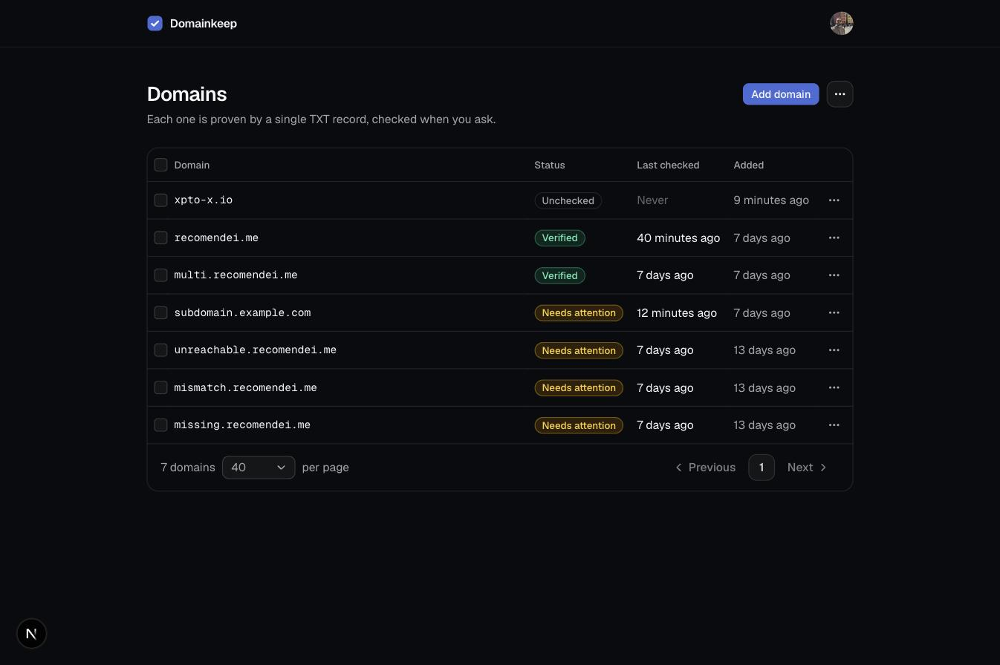

## Adding a domain

Validation runs the same normalization the server uses, so the feedback is instant and specific. Adding never runs a DNS lookup.

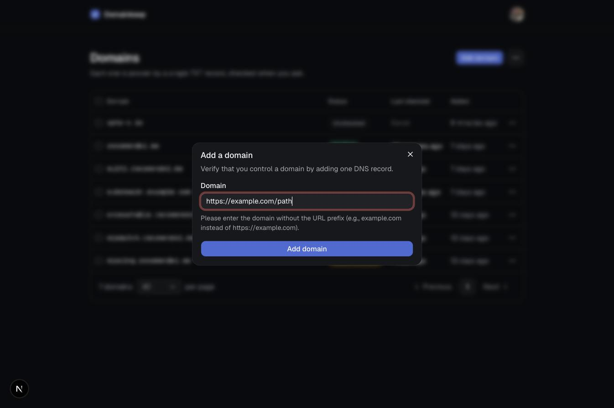

## The record card

A domain that has never been checked. Type, Name, Value, and TTL are laid out the way a DNS provider asks for them. Name is the provider-style label, the full hostname is spelled out underneath, and every value is copyable. The takeover warning sits beside the button before anything has happened.

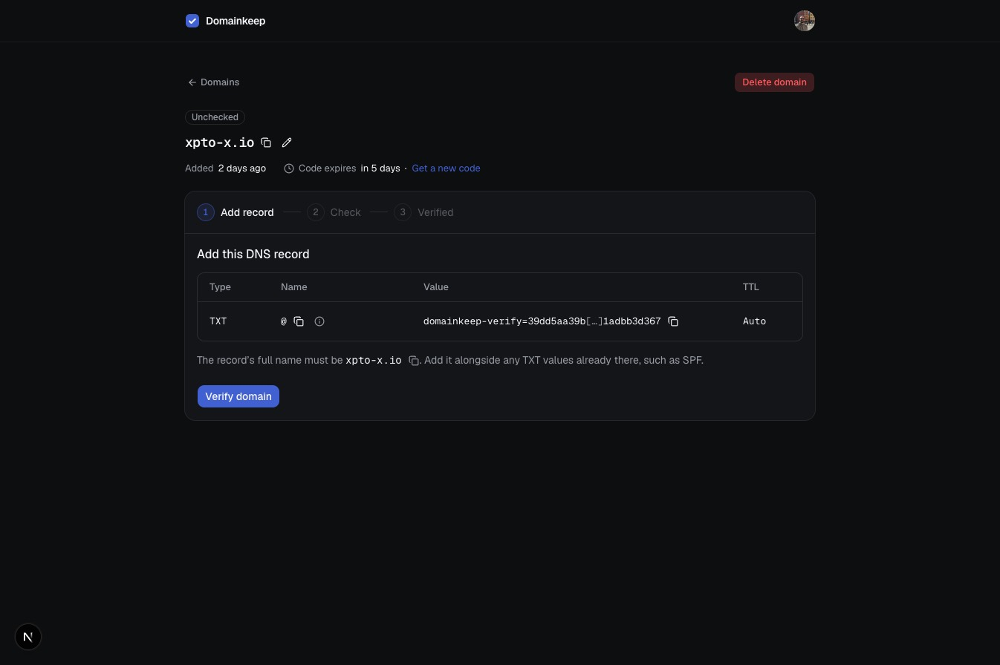

## Record not found

The first miss is usually propagation, so the copy says "yet", the code stays valid, and the checklist stays folded until opened.

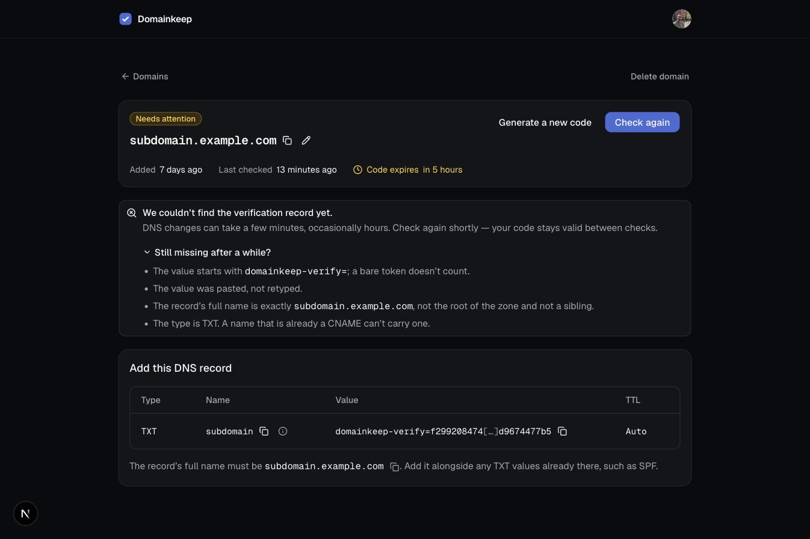

## Value mismatch

The record exists but no value matches. The expected value sits beside what DNS actually returned.

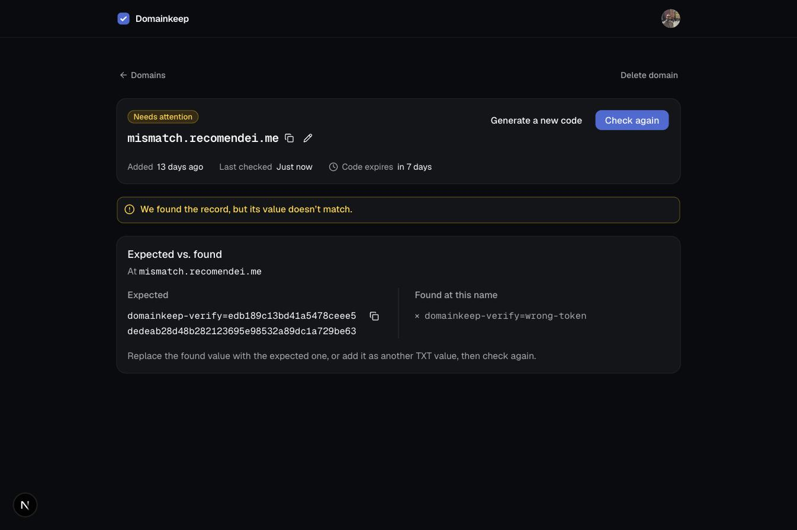

## DNS did not respond

A lookup that timed out or was refused. Nothing needs changing; the user retries.

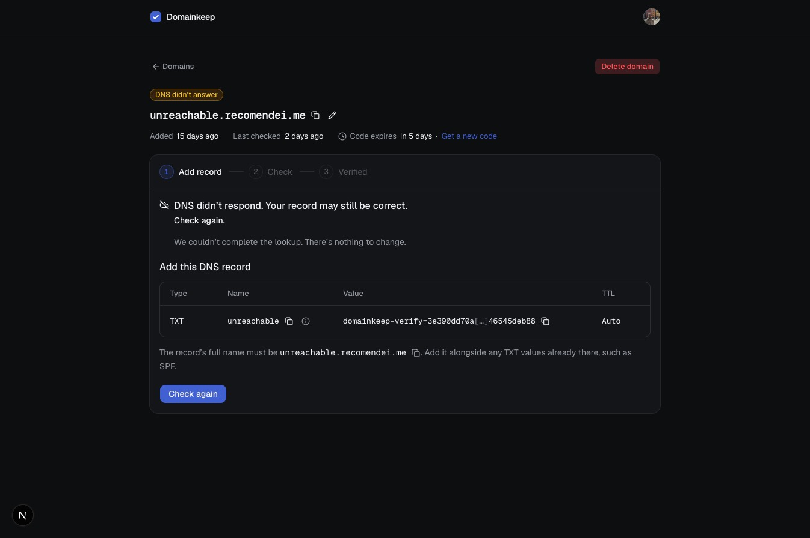

## Held elsewhere

The record matched, but another account holds the domain. Nothing has moved and nobody has been told; the transfer runs only on an explicit Take over. This one is the previous holder taking their domain back after being superseded, so the note above the alert names when it moved.

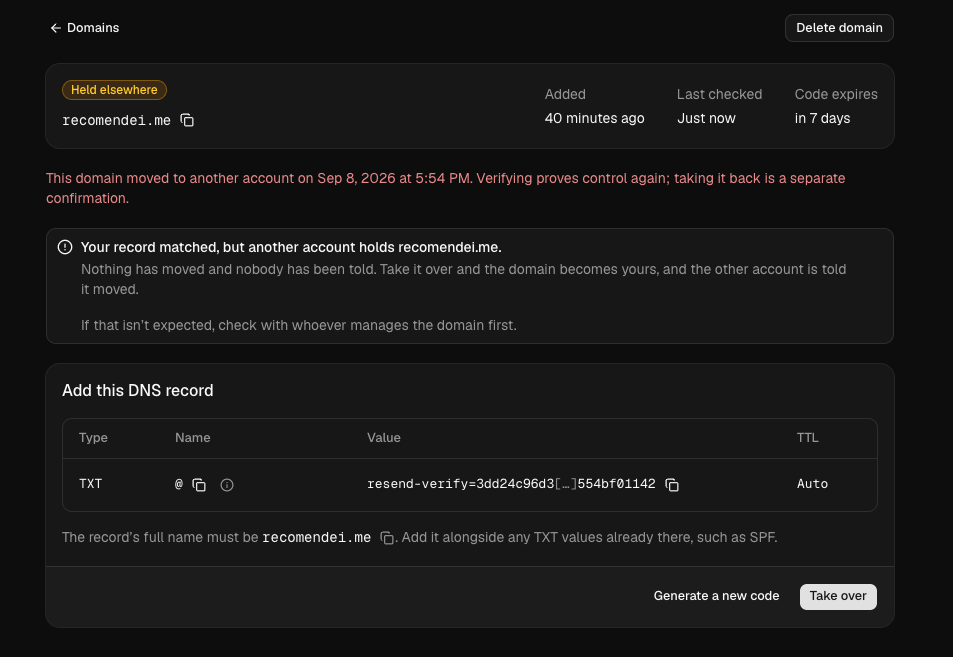

## Verified

Verification is point in time. The record card is gone and the user is told the TXT value can be removed.

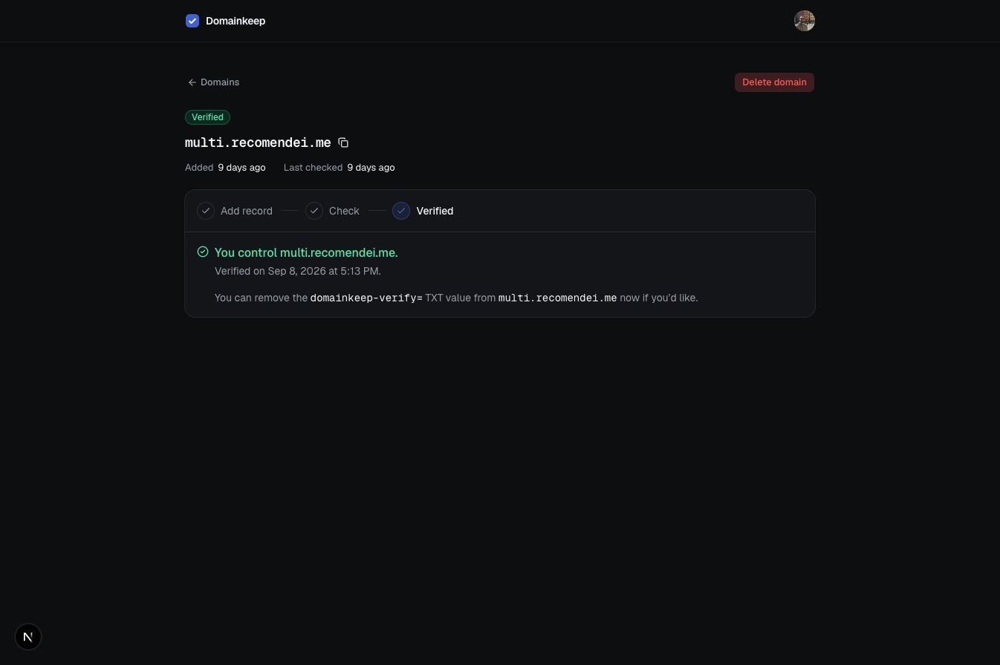

## Superseded

The previous holder's view after another account proved control: the row in their list, the claim itself with the date and the way back, and the email sent through Resend.

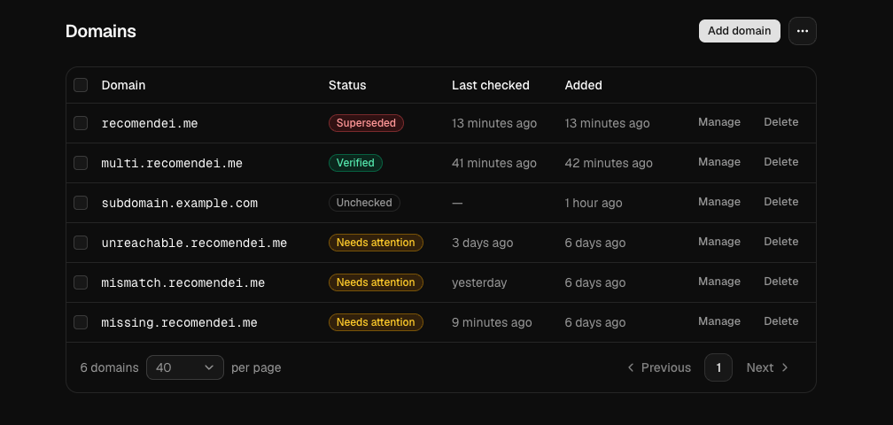

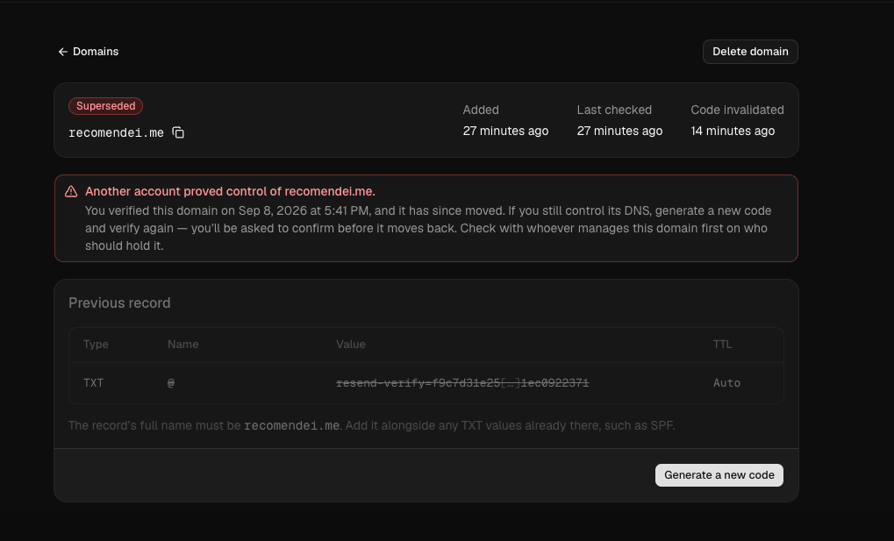

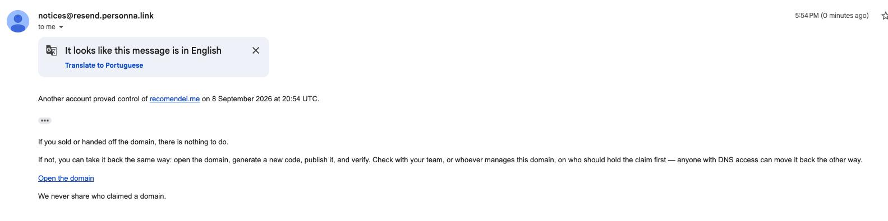

## Deleting a verified domain

The confirmation says what deletion means: the domain is free for anyone who controls its DNS.

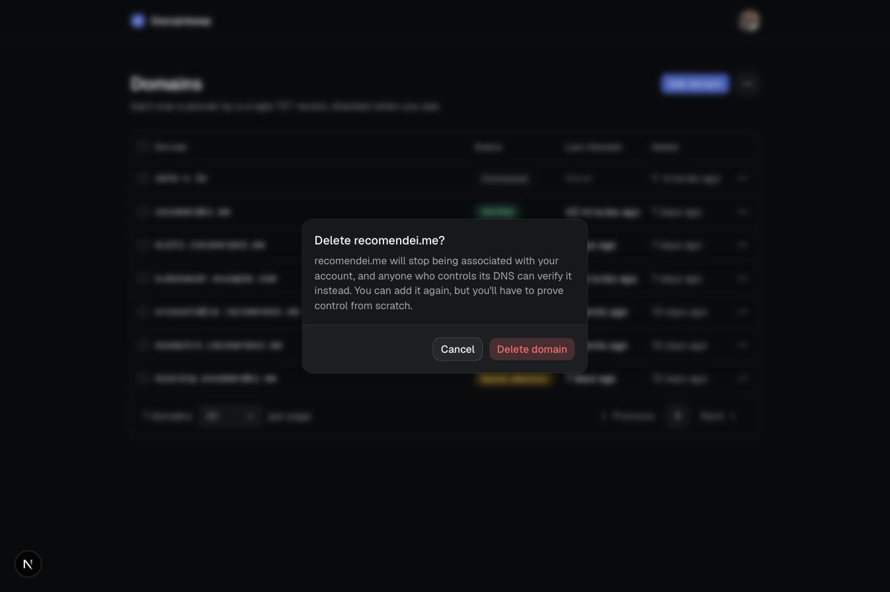

## Not pictured

The takeover confirmation dialog that follows Take over, and the expired-code state, which needs a week-old token to reproduce.
