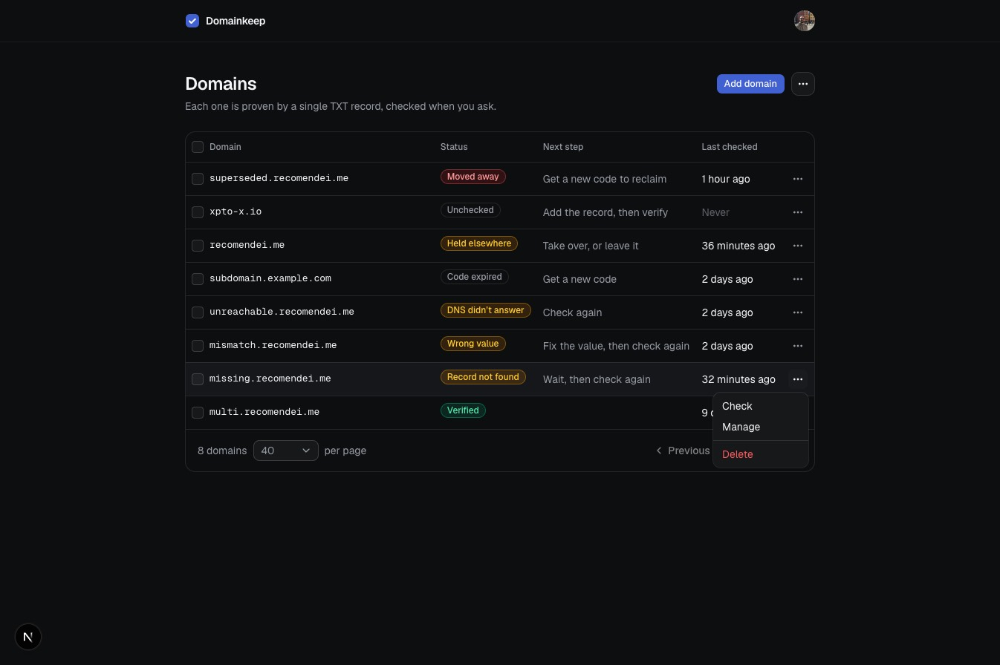
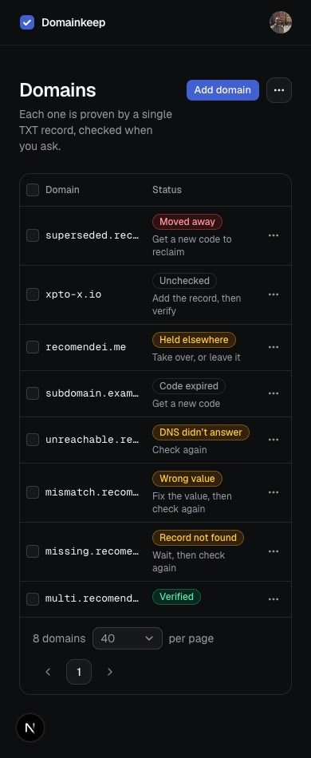

# Screenshots

Every screen a user can reach, for anyone who would rather look than sign up. Captured from a local build on 2026-09-17.

## The domains list

Eight states, eight labels, and beside each one the single next step it asks for — so the list reads as a to-do list rather than a status board. The domains with work left sort above the verified ones. The name opens the domain; one menu per row holds the rest.

The menu is where a row acts. A check appears only on the states another lookup could still change, so the four that are waiting on DNS offer one and the four that are settled or need a decision do not. Delete is set apart from the two that navigate.

Narrow enough and the two right-hand columns give up their space to the name, and the next step moves under the badge it belongs to. Guidance that scrolls off the side is guidance nobody reads.

Rows can be selected and deleted together; the page size and page number live in the URL.

## Adding a domain

Validation runs the same normalization the server uses, so the feedback is instant and specific. Adding never runs a DNS lookup.

## The record and its check

A domain that has never been checked. One card holds the whole step: the three-step strip at its head says where the domain is, the record follows, and the single button that acts on it closes the card, so reading top to bottom ends at the action. Type, Name, Value and TTL are laid out the way a DNS provider asks for them: Name is the provider-style label, the full hostname is spelled out underneath, and every value is copyable.

## Record not found

The first miss is usually propagation, so the copy says "yet", the code stays valid, and the checklist stays folded until opened. It stays open across a re-check.

## Value mismatch

The record exists but no value matches — the one outcome that proves something was published, so the strip moves to step two. The panel opens with the fix, and the expected value sits beside what DNS actually returned, so correcting it is a comparison rather than a guess.

## DNS did not respond

A lookup that timed out or was refused. Nothing needs changing and nothing was learned about the record, so the strip stays at step one and the user retries.

## Expired

A code past its seven days. The first step renames itself and turns amber, because nothing can move until the code is replaced. The previous record is shown struck through for reference, and the only way forward is a new code.

## Held elsewhere

The record matched, so the strip reaches step two — but another account holds the domain. Nothing has moved and nobody has been told; the transfer runs only on an explicit Take over, and leaving it alone is offered beside it as an answer in its own right.

The confirmation that follows. Cancelling sends nothing; the other account learns of the transfer only if the user goes ahead.

## Verified

Verification is point in time. All three steps are done, the record is gone from the page, and the user is told the TXT value can be removed.

## Moved away

The previous holder's view after another account proved control. Their row is the first in the list above; the claim itself carries the date, the invalidated code, and the way back — a new code, which is again the first step.

## Deleting a verified domain

The confirmation says what deletion means: the domain is free for anyone who controls its DNS.

## Not pictured

The notice email the previous holder receives after a takeover.
