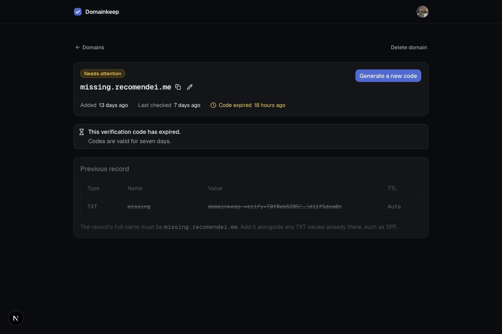

# Screenshots

Every screen a user can reach, for anyone who would rather look than sign up. Captured from a local build on 2026-09-15.

## The domains list

Badges collapse the claim states by next action: Verified, Unchecked, Needs attention, Held elsewhere, Superseded. The name opens the domain; one menu per row holds Manage and Delete. Rows can be selected and deleted together; the page size and page number live in the URL.

## Adding a domain

Validation runs the same normalization the server uses, so the feedback is instant and specific. Adding never runs a DNS lookup.

## The record card

A domain that has never been checked. The domain is the page title, the check stands beside it, and the code's expiry is the one timestamp that can turn amber. Type, Name, Value, and TTL are laid out the way a DNS provider asks for them: Name is the provider-style label, the full hostname is spelled out underneath, and every value is copyable.

## Record not found

The first miss is usually propagation, so the copy says "yet", the code stays valid, and the checklist stays folded until opened. It stays open across a re-check.

## DNS did not respond

A lookup that timed out or was refused. Nothing needs changing; the user retries.

## Expired

A code past its seven days. The previous record is shown struck through for reference, and the only way forward is a new code.

## Verified

Verification is point in time. The record card is gone and the user is told the TXT value can be removed.

## Deleting a verified domain

The confirmation says what deletion means: the domain is free for anyone who controls its DNS.

## Not pictured

Value mismatch (expected versus found), held elsewhere with its Take over dialog, and the previous holder's superseded view with the notice email. Each needs a second account or a deliberately wrong record to reproduce.
